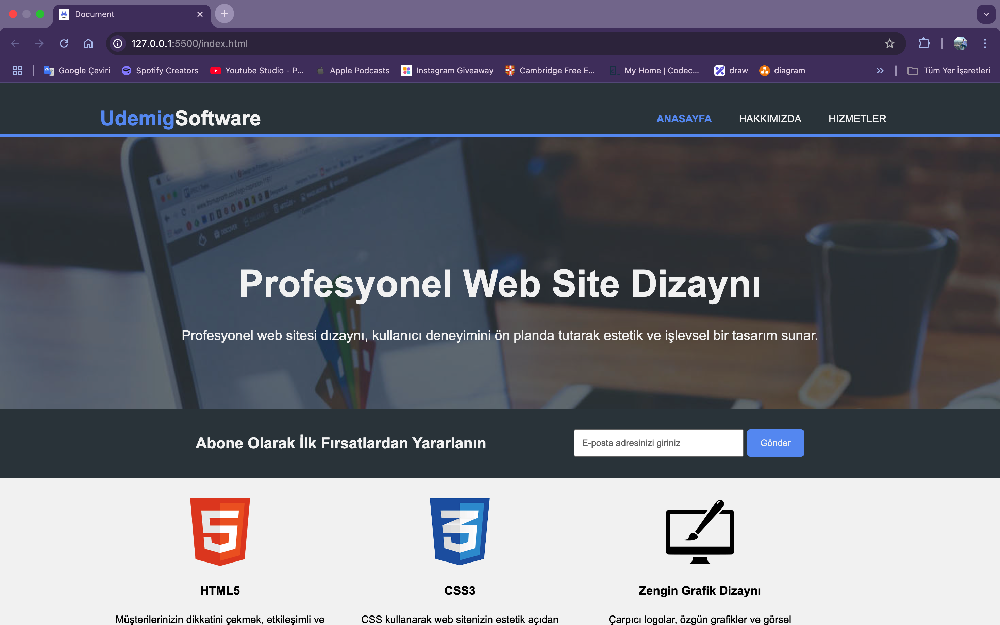
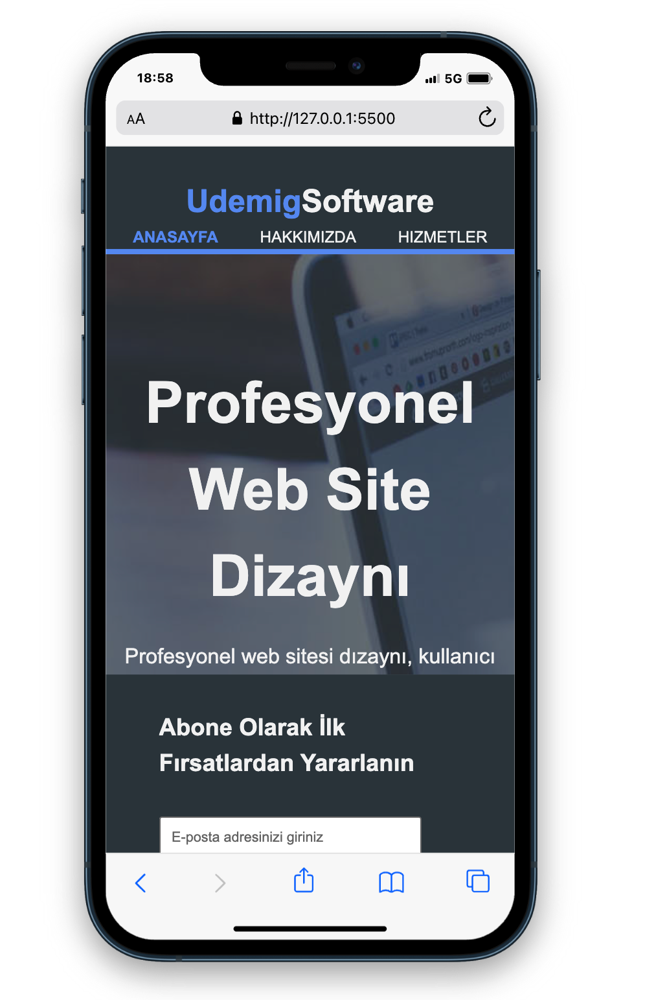
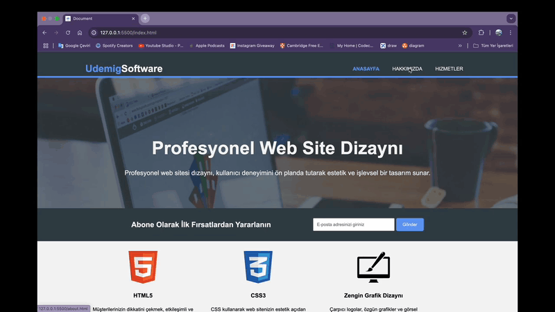

# Udemig Software

Bu proje, bir yazılım okulunu tanıtmak amacıyla geliştirilen **Udemig Software** isimli web sitesidir. **HTML** ve **CSS** kullanılarak oluşturulmuş olup **responsive** tasarıma sahiptir.

## ✨ Özellikler
- **Responsive Tasarım**: Tüm cihazlarla uyumlu mobil dostu arayüz.
- **Yazılım Okulu Tanıtımı**: Kurslar, eğitmenler ve öğrenim süreci hakkında bilgiler.
- **Temiz ve Modern Tasarım**: Kullanıcı dostu ve sade bir kullanıcı arayüzü.

## 📚 Kullanılan Teknolojiler
- **HTML5**
- **CSS3**

## 🚀 Kurulum
Projeyi çalıştırmak için aşağıdaki adımları takip edebilirsiniz:

1. Bu repoyu klonlayın:
   ```bash
   git clone https://github.com/Bahadir34/udemig-software.git
   ```
2. Proje klasörüne gidin:
   ```bash
   cd udemig-software
   ```
3. `index.html` dosyasını tarayıcınızda açın.

## 🖼️ Ekran Görüntüleri



## 👤 Katkıda Bulunma
Projeye katkıda bulunmak isterseniz **pull request** açabilirsiniz.

## 🌐 Canlı Önizleme



---
_Bu proje yalnızca eğitim amaçlı geliştirilmiştir ve ticari bir amacı bulunmamaktadır._

